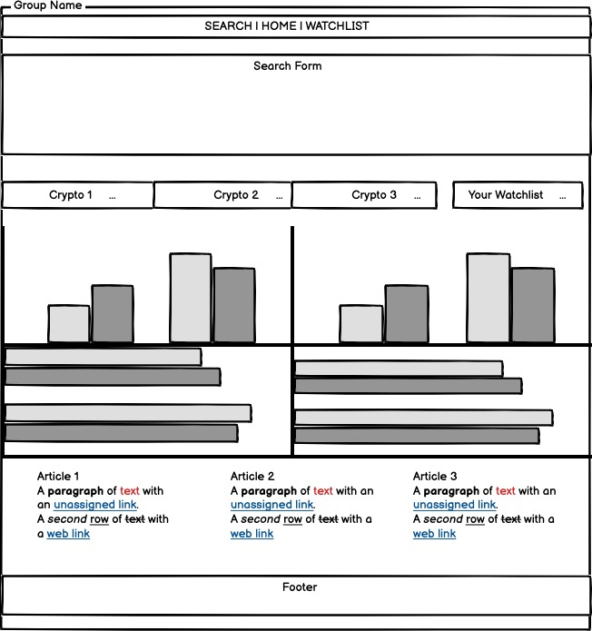
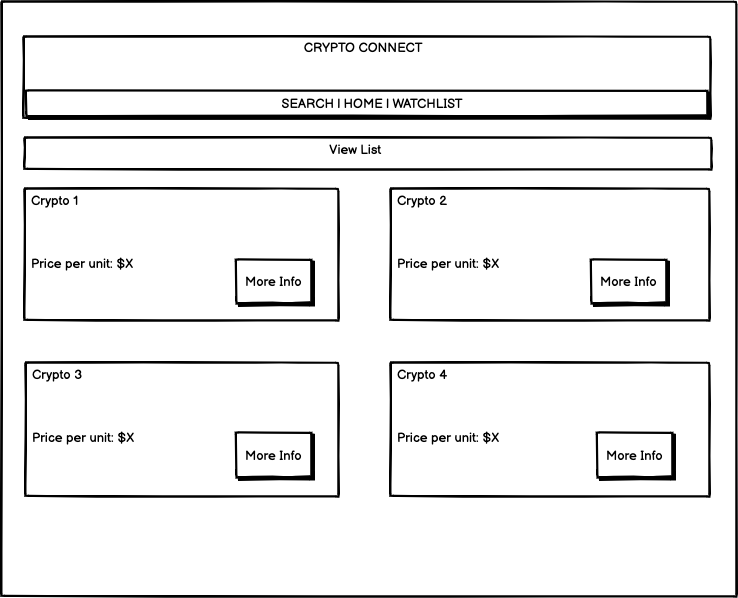
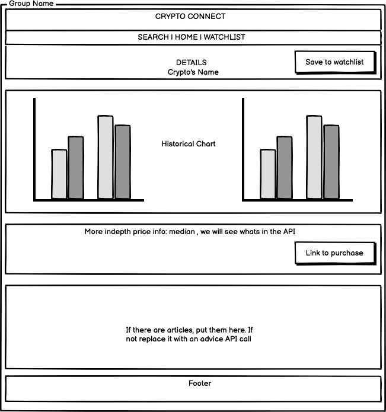

## Vision        
> To provide a hub to learn everything you need to know to make an informed buying decision about cryto currency, The pain point it solves is giving investors 
options to diversify their portfolio with adding information about crypto currency . you should care about this because of the possibilities it opens up for you when choosing where to try and make your passive income

## Functional Requirements

- user can save and delete from watch list (database persistance) 
- user can search price ranges
- 

## Data flow

 - user opens app
 - server requests data from apis
 - apis pass data to home page
 - user searches under a certain query
 - api fetches taht data and displays
 - user desides if they want to watch that crypto
 - that  crypto is saved to db so the site is ready to grab data on site load
 - user opens site with watch listed entries site grabs the watch listed data as well.

